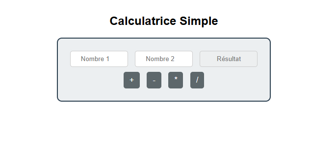
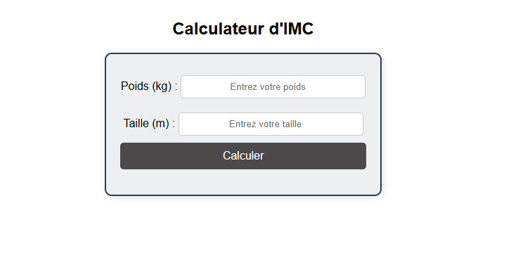
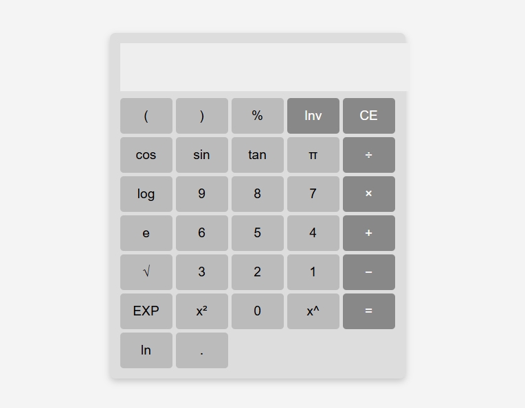

# 📌 Projet : Calculatrice d'IMC, Permutation et Calculatrice Simple

Ce projet contient trois applications web simples :
1. **Permutation de Texte**
2. **Calculatrice Simple** (Addition, Soustraction, Multiplication, Division)
3. **Calculateur d'IMC** (Indice de Masse Corporelle)
2. **Calculatrice Complete** 

Chaque application est développée en **HTML, CSS et JavaScript**.

---

## 📂 Structure des fichiers

```
/Projet
│── screenshots
│── permutation.html
│── mini-calculatrice.html
│── imc.html
│── complete-calculatrice.css
│── README.md
```

---

## 📝 Documentation des fichiers

### 1️⃣ Permutation de Texte

- **Fichier :** `permutation.html`
- **Description :** Cette application permet de permuter le contenu de deux champs de texte en cliquant sur un bouton.
- **Technologies utilisées :** HTML, CSS, JavaScript

#### ✨ Fonctionnalités :
- Deux champs de saisie pour entrer du texte
- Un bouton permettant de permuter les valeurs entre les deux champs


---

### 2️⃣ Calculatrice Simple

- **Fichier :** `calculatrice.html`
- **Description :** Cette application exécute des opérations mathématiques de base (addition, soustraction, multiplication, division).
- **Technologies utilisées :** HTML, CSS, JavaScript

#### ✨ Fonctionnalités :
- Deux champs pour saisir des nombres
- Quatre boutons représentant les opérations mathématiques
- Affichage du résultat après le calcul


```

```

---

### 3️⃣ Calculateur d'IMC

- **Fichier :** `imc.html`
- **Description :** Cette application calcule l'Indice de Masse Corporelle (IMC) et affiche une interprétation selon l'OMS.
- **Technologies utilisées :** HTML, CSS, JavaScript

#### ✨ Fonctionnalités :
- Un champ pour entrer le poids
- Un champ pour entrer la taille
- Un bouton pour calculer l'IMC
- Un affichage du résultat et son interprétation


```

```

---

### 2️⃣ Calculatrice Complete

- **Fichier :** `Calculatrice.html`
- **Description :** Cette application exécute les opérations mathématiques basique et avancées.
- **Technologies utilisées :** HTML, CSS, JavaScript

#### ✨ Fonctionnalités :
- Des boutons représentant les nombres
- Des boutons représentant les opérations mathématiques
- Un champs pour l'affichage du résultat après le calcul

```

```

---

## 🚀 Installation et utilisation

1. Clonez le projet :
   ```sh
   git clone https://github.com/votre-repo.git
   ```
2. Ouvrez chaque fichier HTML dans un navigateur.
3. Testez les fonctionnalités et ajoutez vos propres améliorations.

---

## 📌 Améliorations possibles
- Améliorer le design avec du CSS avancé.
- Ajouter une validation des entrées utilisateur.
- Enregistrer les résultats dans le stockage local du navigateur.

---

## ✍️ Auteur
**Moufadil Walid**

---

📩 **Contact :** Si vous avez des suggestions ou des questions, n'hésitez pas à me contacter ! 🚀

