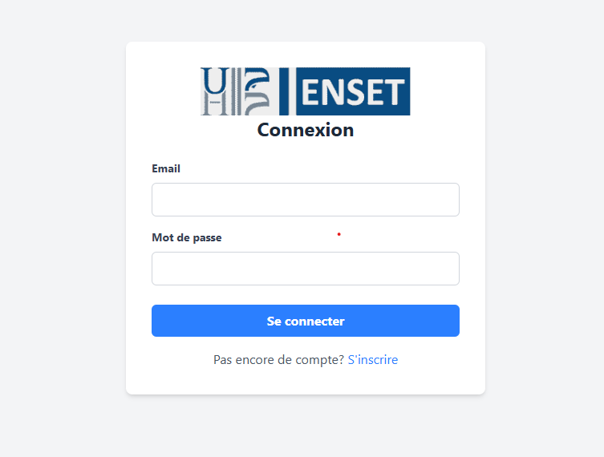
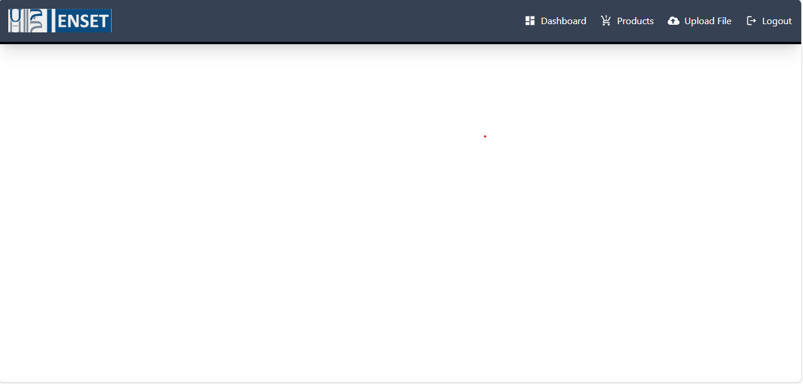

# React Authentication Project

## Description
Ce projet est une application React.js qui comprend :
- Une page d'authentification
- Une page d'inscription
- Une landing page avec une barre de navigation contenant :
  - Dashboard
  - Produits (Products)
  - Upload de fichiers (UploadFile)

## Technologies utilisées
- React.js
- React Router
- Tailwind CSS (ou autre framework CSS selon ton choix)
- Axios (pour les requêtes API)

## Installation
### Prérequis
- Node.js installé
- npm ou yarn installé

### Étapes d'installation
1. Cloner le dépôt :
   ```bash
   git clone https://github.com/ton-repo.git
   ```
2. Accéder au dossier du projet :
   ```bash
   cd nom-du-projet
   ```
3. Installer les dépendances :
   ```bash
   npm install
   ```
   ou avec Yarn :
   ```bash
   yarn install
   ```


## Fonctionnalités
### Authentification
- Connexion avec email et mot de passe
- Redirection vers le dashboard après connexion réussie

### Inscription
- Création d'un compte avec email et mot de passe
- Redirection automatique vers la page de connexion après inscription

### Landing Page
- Navigation avec Navbar :
  - **Dashboard** : Vue d'ensemble après connexion
  - **Products** : Liste des produits disponibles
  - **UploadFile** : Page permettant de téléverser des fichiers

## Captures d'écran
### Page d'authentification


### Page d'inscription


### Dashboard



```


